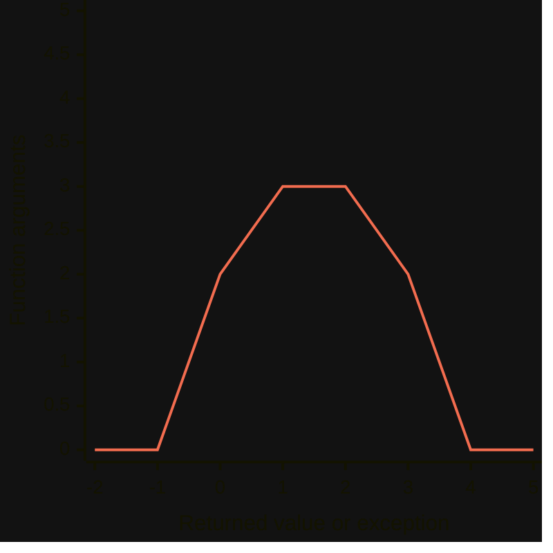

---
# You can also start simply with 'default'
theme: default
themeConfig:
  primary: '#F26C4F'

colorSchema: dark

title: "Functional Refactoring: Preparing Code for Future Features"
class: text-center
drawings:
  persist: false
transition: slide-left
mdc: true
---

# <span v-mark="{ type: 'underline', color: '#F26C4F'}">Functional Refactoring</span> 

## Preparing Code for Future Features

<br>

Hello Stavanger 2024 | Matěj 'Horm' Horák<br>

<!--
BE developer for a company called Airthings

experience using functional refactoring practice to prepare code future features

avoid unstable codebase and hard-to-maintain

highlight word experience

struggles, things that helped me, but also pain points

but what are we trying to solve?
-->

---
layout: image
image: /coderetreat_me.jpg
backgroundSize: 30em
---

... in 2015

<!--
let's go back in time

and actually I'm excited to be here, special moment

I was lucky enough to join GDG

one of the first events

was not about how to do things

but how to do things better
-->

---
layout: center
---

### Is it possible to <span v-mark="{ type: 'underline', color: '#F26C4F'}">seamlessly integrate</span> features with <span v-mark="{ type: 'underline', color: '#F26C4F'}">minimal changes</span> to existing code? 🤔

<!--
meaning be able to deliver features

without downtimes

bugs

or just without being overwhelmed

(large PRs, rewrites, buggy codebase)
-->

---
layout: center
---

<iframe src="https://giphy.com/embed/11ZSwQNWba4YF2" width="246" height="480" style="" frameBorder="0" class="giphy-embed" allowFullScreen></iframe>

<!--
all of this is just a nature of SW development

and this question does not have definitive answer

but since 2015 I experienced couple of methods

that helped me in this matter

and I would like to share them with you
-->

---
layout: center
---

# <span v-mark="{ type: 'underline', color: '#F26C4F'}">Functional Refactoring</span><sup>TM pending 😇</sup>

<!--
I call it functional refactoring, my own term

inspired from functional programming

really like  refactoring

and I often say "we can adjust this to make it more functional"
-->

---

# Outline

<br>

1️⃣ Quick intro to functional programming

<br>

2️⃣ Seamlessly integrate with functional thinking

<br>

3️⃣ Minimal changes to code with tidy-first practice

<br>

4️⃣ Going big and summary

<!--
but in more practical terms I will go through

speed intro to FP - basics for the next topic

how to achieve seamless changes with a code structure called functional thinking

how to deliver features via small updates with tidy first

and lastly how to apply this in bigger context

... and some resources by the end
-->

---
layout: image
image: /coderetreat_milan.jpg
backgroundSize: 25em
---

... @MilanLempera, GDG Jihlava

<!--
before I move on, quick side

I mentioned I was part of a community

And I would like to shout out

him and these people were a big influence on me

and my talk is about my personal learning experience

but a lot of things I know in this matter is because of them
-->

---

# Outline

<br>

1️⃣ <span v-mark="{ type: 'underline', color: '#F26C4F'}">Quick intro to functional programming</span>

<br>

2️⃣ Seamlessly integrate with functional thinking

<br>

3️⃣ Minimal changes to code with tidy-first practice

<br>

4️⃣ Going big and summary

<!--
so let's start with...
-->

---
layout: center
---

# What is really Functional Programming? 🤔

<!--
always saw it as something mystical and cool

but in reality, it is a bit of a buzzword that is 

hard to fully understand

apply in real use cases

a lot of fancy terms but how to DI?
-->

---
layout: center
---

## Each X has own Y

<br>



<!--
the main thing to remember is to write pure functions or methods

each input has the same output

In FP language, this means we would like to avoid side effects

comparison with OOP

let's take look at more practical example
-->

---

````md magic-move
```js
let reveiws = ["4/5 - Solid place to spend a night!"]

function addReview({ rating, comment }) {
  reveiws = [...reveiws, `${rating}/5 - ${comment}`]
}

addReview({rating: 1, comment: "Found bugs :/"})
```

```js
let reveiws = ["4/5 - Solid place to spend a night!"]

function addReview({ reviews, rating, comment }) {
  return [...reveiws, `${rating}/5 - ${comment}`]
}

reveiws = addReview({rating: 1, comment: "Found bugs :/"})
```

```js
const reveiws = ["4/5 - Solid place to spend a night!"]

function addReview({ reviews, rating, comment }) {
  return [...reviews, `${rating}/5 - ${comment}`]
}

const updatedReviews = addReview({rating: 1, comment: "Found bugs :/"})
```
````

<!--
imagine we have an application for storing interesting places and writing reviews

you can see we have a function for adding a review

you can also see we override the reviews

in FP, this is a side effect

we can make it more functional (refactoring) and return new instead of overriding

or even further and just create a new variable

... so if I go back...
-->

---
layout: center
---

## Each X has own Y

<br>


<!--
we need to make sure X and Y

it can run multiple times

you can see exceptions in the chart

exception in a way can be also type of output but we will get back to this

but overall this is really good for testing

which type of input do I need to cover?
-->

---

````md magic-move
```js
describe('addReview', () => {
  it('should return a list with added review', () => {
    const result = addReview({
      reviews: ["4/5 - Solid place to spend a night!"],
      rating: 1,
      comment: "Found bugs :/",
    })
    
    result.toBeEqual([
      "4/5 - Solid place to spend a night!",
      "1/5 - Found bugs :/"
    ])
  });
});
```

```js
describe('addReview', () => {
  it('should return a list with added review', () => {
    // ...
  });

  
  it('should not add review with negative rating', () => {
    const result = addReview({
      reviews: ["4/5 - Solid place to spend a night!"],
      rating: -10,
      comment: "Found bugs :/",
    })

    result.toBeEqual([
      "4/5 - Solid place to spend a night!",
    ])
  });
});
```

````

<!--
if we go back to our example

we have our pure function

and we can think, what could go wrong? 

and it is much easier because there is no state to deal with

so in this case we can think of what should happen for negative score
-->

---
layout: center
---

# Avoid side effects that can surprise you ✅

<!--
a great practice to start using when modifying your applications

benefits from the start

finding which type of input to cover

finding what type of code we can refactor and make more functional

... without side effects
-->

---
layout: center
---

# Functional programming in reality❓

<!--
and this works very well but at some point you wonder...

FP in bigger scale

hard to be certain how to design the architecture

How to structure the application?

How to manage the database connections?

How to deal with errors?

looking for solutions until Milan Lempera
-->

---

# Outline

<br>

1️⃣ Quick intro to functional programming

<br>

2️⃣ <span v-mark="{ type: 'underline', color: '#F26C4F'}">Seamlessly integrate with functional thinking</span>

<br>

3️⃣ Minimal changes to code with tidy-first practice

<br>

4️⃣ Going big and summary

<!--
recommended functional thinking by Eric Normand

so now we will look at how functional thinking can help us seamlessly integrate bigger changes
-->

---
layout: center
---

# Data, Calculations, Actions 🧑‍💻

... concept by Eric Normand

<!--
splitting code into 3 categories

Actions - things do not want to run multiple times

(modifying variables, logs, sending email)

Calculations - functions with inputs matching exact outputs (no matter when we call them)

(mathematical operations, string templates, data constructor)


Data is just data - inputs (numbers to multiply, email)

but also hard-coded rules (unit conversion rules etc.)
-->

---

```js {all|3,8,14,17|10,11,19,20|all}
function createPlace({place}) {
  // ...
  validatePlace(place)
  // ...
  console.log("user created place");
}

function validatePlace({ name, photos }) {
  if (name === '') {
      console.log("user passed invalid name");
      throw Error("name cannot be empty")
  }
  
  photos.forEach(photo => validatePhoto(photo))
}

function validatePhoto({url}) {
  if (!url.startsWith("https://")) {
    console.log("user passed invalid name");
    throw Error("url needs to start with https")
  }
}
```

<!--
back to our example and to see how does it help us

we can see we have validation

we log and we throw, it does matter when and it can surprise us

let's apply functional refactoring
-->

---

```js {none|14-25|0-13|all}
function createPlace({ place }) {
  // ...
  const validationErrors = validatePlace(place)

  if (validationErrors.length !== 0) {
    console.log(`user passed invalid place: ${validationErrors}`)
    throw Error(validationErrors)
  }

  // ...
  console.log("user created place");
}

function validatePlace({ name, photos }) {
  return [
    ...(name !== '' ? [] : ["name cannot be empty"]),
    ...(photos.map(photo => validatePhoto(photo)).flat())
  ]
}

function validatePhoto({ url }) {
  return [
    ...(url.startsWith("https://") ? [] : ["url needs to start with https"])
  ]
}
```

<!--
instead of throwing we can return the result

in this case, the list of errors as strings

we transformed some input (data and calculations)

and by the end, we do action and log and throw
-->

---

```js {all|0-3|5,9,14-17|6-7,10-11,19-21|all}
function createPlace({ place, database }) {
  const validationErrors = validatePlace(place)
  const exists = database.get(place.name)

  if (validationErrors.length !== 0) {
    console.log(`user passed invalid place: ${validationErrors}`)
    throw Error(validationErrors)
  }
  if (exists) {
    console.log(`user tried to create existing place ${place.name}`)
    throw Error(`place ${place.name} already exists`)
  }

  const created = {
    ...place,
    id: randomId()
  }

  database.upsert(created)
  console.log("user created place");
  return created
}
```

<!--
more complete example

how does it help us? simple change surprise in another place

this structure helps us to be consistent and be more predictable

it also helps with debugging

tests, came to conclusion that are not enough

we can be more flexible (generating ID, upsert)
-->

---

# New way to structure code

We can start applying this structure to any type of codebase...

<v-click>

````md magic-move
```js
function createPlace({ place, database }) {
  // ...
  database.upsert(created)
  console.log("user created place");
  return created
}
```

```js
function createPlace({ place, database, eventBus }) {
  // ...
  database.upsert(created)
  eventBus.publish({type: "create", value: created})
  console.log("user created place");
  return created
}
```
````

</v-click>

<!--
good refactoring practice, immidiate benefits

this new structure allows us to be more flexible with the actions

for example adding new storage
-->

---

# Extending our inputs and outputs

````md magic-move
```js
describe('createPlace', () => {
  it('should create place and store in database for valid input', () => {
    // ...
  });

  it('should throw an errror for invalid input', () => {
    // ...
  });
});
```

```js
describe('createPlace', () => {
  it('should create place and store in database for valid input', () => {
    // ...
  });

  it('should throw an errror for invalid input', () => {
    // ...
  });

  it('should throw an error if place with same name exists', () => {
    // ...
  });
  
  // ...
});
```
````

<!--
and coming back to the FP style

what type of inputs do we need to cover
-->

---
layout: center
---

# This helps seamlessly integrate new features ✅

<!--
I start applying this, 

 suddenly was easier to extend and add new features

the structure helps you to navigate and and provides flexibility so it is easy to adjust things

however this is just related to small adjustments
-->

---
layout: center
---

# How to deliver larger features❓

<!--
What if we have to deliver something bigger? 

I like myself and I want to avoid large PRs

hard to test

it felt there is not much option
-->

---

# Outline

<br>

1️⃣ Quick intro to functional programming

<br>

2️⃣ Seamlessly integrate with functional thinking

<br>

3️⃣ <span v-mark="{ type: 'underline', color: '#F26C4F'}">Minimal changes to code with tidy-first practice</span>

<br>

4️⃣ Going big and summary

<!--
until I discovered tidy first practice 

that is about releasing features with minimal changes
-->

---
layout: center
---

# Tidy-First Practice 🧽

... Concept by Kent Beck

<!--
about distiunguish structural and behaviour changes

work in a way how can we prepare the code base

to make the change easy and then make the change

invest in structure

the opposite is rewrite

tidy instead of refactoring

small PRs merged faster, deployable PR

not be blocked by waiting for a review

let's take a look at more practical example
-->

---

# Small and safe PRs

When adding a new feature to existing legacy code...

1. Multiple PRs adding test coverage
2. Multiple PRs refactoring legacy code
3. PR adding utils for the feature
4. Adding feature code without showing to user
5. Multiple PRs improving feature and tests
6. Small PR enabling it

<!--
adding a new feature to legacy code is quite common

instead of asap, invest appropriate time

.... explain

sometimes it is good to also prototype a bit

what is good to refactor
-->

---
layout: center
---

# Extreme Programming 🔥

<!--
we can go to extreme

do we need really PR if all changes are atomic? 

Kent is author

I don't have experience

Code reviews are good but we can inspire from it
-->

---
layout: center
---

## ❌ Not about making everything generic

<br>

## ❌ Not about spending all the time on refactoring

<!--
architecture guidelines things about isolation

no interfaces, encapsulation, etc.

we still should deliver features

using common sense
refactor at the right time

managers like soft release, incremental update, less risk
-->

---

# Compatible with functional thinking 🙌

We can invest in...

- Make data structures more flexible and easy to use
- Optimise and make calculations more readable
- Prepare actions and enable them at the right time

<!--
and on top of that, it goes well

We can invest in data structures and calculations

is it difficult to access specific information?

Are our calculations fast enough? 

For example, adding a new property
-->

---
layout: center
---

# New features with minimal change ✅

<!--
and it will get some to get used to this

you will still get some things that will be hard

but then I always think of

OK, what do we need to fix here?

And in the end I end up with solution that is easy to release but also rollback
-->


---

# Outline

<br>

1️⃣ Quick intro to functional programming

<br>

2️⃣ Seamlessly integrate with functional thinking

<br>

3️⃣ Minimal changes to code with tidy-first practice

<br>

4️⃣ <span v-mark="{ type: 'underline', color: '#F26C4F'}">Going big and summary</span>

<!--
this was a lot of talking 

so let's summarize
-->

---
layout: center
---

## <span v-mark="{ type: 'underline', color: '#F26C4F'}">Stability</span> - Pure Functions ✅

<br>

## <span v-mark="{ type: 'underline', color: '#F26C4F'}">Flexibility</span> - Data, Calculations and Actions ✅

<br>

## <span v-mark="{ type: 'underline', color: '#F26C4F'}">Productivity</span> - Tidy-first ✅

<!--
in conclusion we talked about

testable and predictable functions - avoid surprises

structuring code into DCA, making our codebase more open to adjustments

way of prioritizing work so we can release new things faster

all of this was more about code

how to do big apps
-->

---
layout: center
---

<iframe src="https://giphy.com/embed/LJzMSr7Rrt815UMfxr" width="480" height="350" style="" frameBorder="0" class="giphy-embed" allowFullScreen></iframe>

<!--
I would like to finish with a thought

what happens when the user type, clicks - action

data - is the thing that wrote

what happens with the data - transformation/calculation
-->

---
layout: center
---

# <span v-mark="{ type: 'underline', color: '#F26C4F'}">Functional refactoring</span> is for...

## small code units

<br>

## whole applications

<!--
we can think how to make things more functional

refactor and enable easy behaviour change with structural changes

to give example
- Streamlining use-cases
- Libraries, design systems
- Feature flags, inputs
- Test coverage


... going back to the start
-->

---
layout: center
---

### Is it possible to <span v-mark="{ type: 'underline', color: '#F26C4F'}">seamlessly integrate</span> features with <span v-mark="{ type: 'underline', color: '#F26C4F'}">minimal changes</span> to existing code? 🤔

<!--
I think it is

Of course, there will be always challenge

but in my experience, functional refactoring helped a lot in this matter

and I manage to finish large projects in time
-->

---
layout: image-right
image: "/grokking_simplicity.jpg"
backgroundSize: 20em
---

# Follow Eric Normand

- Book [Grokking Simplicity](https://grokkingsimplicity.com/)
- [@EricNormand](https://x.com/EricNormand), [ericnormand.me](https://ericnormand.me)
- [The Eric Normand Podcast](https://ericnormand.me/podcast)

<!--
if you like this talk I would like to share some resources

you can follow Eric

book I read for beginners

but also podcast
-->

---
layout: two-cols
---

# Follow Kent Beck

- [Tidy-First blog](https://tidyfirst.substack.com/)
- [@KentBeck](https://x.com/KentBeck), [kentbeck.com](https://www.kentbeck.com/)
- Book [Tidy-First](https://www.oreilly.com/library/view/tidy-first/9781098151232/)

::right::

<br>
<br>

<iframe width="450em" height="315em" src="https://www.youtube.com/embed/BFFY9Zor6zw?si=C610OiGAWSOhO_du" title="YouTube video player" frameborder="0" allow="accelerometer; autoplay; clipboard-write; encrypted-media; gyroscope; picture-in-picture; web-share" referrerpolicy="strict-origin-when-cross-origin" allowfullscreen></iframe>

<!--
you can also follow Kent

this is the presentation I heard about tidy first first time

but he has also a blog that was transformed in a book

he has also many other interesting resources about refactoring and testing
-->

---
layout: image-right
image: /qr.png
backgroundSize: 20em
---

# Follow me 😇

- Resources at [horm.codes](https://horm.codes)
- <span v-mark="{ type: 'underline', color: '#F26C4F'}">@HormCodes</span> at [X](https://x.com/HormCodes), [LinkedIn](https://www.linkedin.com/in/HormCodes), [GitHub](https://github.com/HormCodes), etc.
- Questions, ...

<!--
lastly, follow me

slides are at this QR code, I will give 10 seconds

I'm using the same username on all social media

... and if you have any questions
-->

---
layout: image
image: /stickers_photo.png
backgroundSize: 30em
---

<!--
I have my personal developer stickers

so if you have any questions or you just want a sticker

feel free to come

and I will be also happy to talk

as I said, I'm still looking for answers and inspiration
-->

---
layout: center
---

# Thank you for your attention! 🙏

<!--
thank you for your attention and enjoy the rest of the conference
-->
