---
# You can also start simply with 'default'
theme: default
themeConfig:
  primary: '#F26C4F'

title: Using NX for Monorepo with Gradle Services
info: |
  ## Slidev Starter Template
  Presentation slides for developers.

  Learn more at [Sli.dev](https://sli.dev)
# apply unocss classes to the current slide
class: text-center
drawings:
  persist: false
transition: slide-left
mdc: true
---

# Using <span v-mark="{ type: 'underline', color: '#F26C4F', at: 0}">NX</span> for Monorepo with Gradle Services

JavaZone 2024<br>Matěj 'Horm' Horák<br>

<!--
experience of managing multiple services with Gradle inside Git repository

Improving efficiency in CI/CD and reducing risk with deployments
-->

---


1️⃣ About monorepo, and its challenges...

2️⃣ Tools for monorepo

3️⃣ Intro to Nx

4️⃣ Setting up Nx with Gradle
 
5️⃣ Last tips and conclusion


<!--
We will firstly talk about
-->

---
layout: image
image: /stickers_photo.png
backgroundSize: 30em
---

<!--
Basic Git and Gradle knowledge required

stickers

QR code with resources 
-->

---
layout: center
---

# 1️⃣ About monorepo, and its challenges...

---

# What is Monorepo?

- A single <span v-mark="{ type: 'underline', color: '#F26C4F'}">repository containing multiple projects</span>, with well-defined relationships ([monorepo.tools](https://monorepo.tools/)).
- Used by Google, Facebook, etc.
- Great for <span v-mark="{ type: 'underline', color: '#F26C4F'}">code sharing, and atomic changes</span>

<!--
change in one sub-module has to be reflected in parent...
-->

---
layout: full
---

# Working Example

```mermaid
flowchart LR
    user["👩‍💻user"]
    api["↻ api"]
    user-event-handler["ƛ user-event-handler"]
    
    user -- "`🌐 HTTP POST /users`" --> api
    api -- "`📆 publishes user-registered-event`" --> user-event-handler
    user-event-handler --->|📧 sends email to user| user
```

<br>
<br>
<br>



---

```kotlin {all|5|7|8-9|all}
// 'apps/api' module
fun Application.routing() {
    val eventBus by inject<EventBus>()
    routing {
        post("/users") {
            // ...
            val user = User(email = "hello@horm.codes", username = "HormCodes")
            eventBus.publish(UserRegisteredEventUser(user))
            call.respond(HttpStatusCode.OK, user)
        }
    }
}
```

---

```kotlin {all|none}
// 'apps/event-handlers/user-event-handler` module
val emailProvider = EmailProvider()

fun process(event: UserRegisteredEvent) {
    // ...
    emailProvider.sendEmail(
      email = event.user.email,
      content = getUserRegisteredContent(event.user),
    )
}
```


<br>

```kotlin {none|all|none}
// 'libs/model' module
data class User(val username: String, val email: String)

data class UserRegisteredEvent(val user: User)
```

<br>

```kotlin {none|all}
// 'libs/email-utils' module
fun getUserRegisteredContent(user: User) = "Hello ${user.username}!"
```

<!--

monorepo means all of this code would be inside a single repository

-->

---

````md magic-move
```kotlin
// 'libs/email-utils' module
fun getUserRegisteredContent(user: User) = "Hello ${user.username}!"
```

```kotlin
// 'libs/email-utils' module
fun getUserRegisteredContent(user: User) = "Hello ${user.username}! How are you?"
```
````

<br>
<br>

```kotlin {none}
// 'apps/event-handlers/user-event-handler` module
val emailProvider = EmailProvider()

fun process(event: UserRegisteredEvent) {
    // ...
    emailProvider.sendEmail(
      email = event.user.email,
      content = getUserRegisteredContent(event.user),
    )
}
```


<!--
Push to `main` deploys all service to _dev_ env, manual deploy to _prod_

CI requires passing tests before merging to `main`

- I made a simple fix for the API but need to wait for all services to be tested
- Releasing all on each push to can be expensive
    - A lot of time spent in CI/CD (GitHub Actions price and spending limit)
    - Too much complexity when not necessary

-->

---
layout: statement
---

## Our CI/CD is <span v-mark="{ type: 'underline', color: '#F26C4F'}">time-consuming</span> and with <span v-mark="{ type: 'underline', color: '#F26C4F'}">a lot of risk</span>...

<!--

... if we change to deploy just one service

- It's easy to forget to deploy a service and that creates a risk

... if only there was tool to fix our issues
-->

---
layout: center
---

# 2️⃣ Tools for monorepo

---
layout: image
image: /google_search.png
backgroundSize: 40em
---


---
layout: two-cols
---

# <span v-mark="{ type: 'underline', color: '#F26C4F'}">Gradle</span>

- Does not repeat already executed tasks
- Hard to optimize in CI/CD

<br>
<br>
<br>


::right::


# <span v-mark="{ type: 'underline', color: '#F26C4F'}">Bazel</span>

- Maintained by Google
- For large enterprise projects? ... Hard to setup 🙃


<br>
<br>
<br>


<!--
Typically all tests were run on each push

A lot of time spent on rebuilding all modules
-->

---
layout: fact
---

## ... but then I remembered...

---
layout: image-right
image: /nx.png
backgroundSize: 20em
---

# Nx

- Tool based on JS ecosystem ❤️
- Open source project with active community
- <span v-mark="{ type: 'underline', color: '#F26C4F'}">Nx uses Nx</span>
- New support for Gradle

<!--
Easy to tweak and change

I'm not paid by Nx
-->

---
layout: center
---

# 3️⃣ Intro to Nx

---
layout: statement
---

## `affected` command analyzing <span v-mark="{ type: 'underline', color: '#F26C4F'}">which files were modified</span>

<!--
I remember affected command
-->

---

# Back to our example...

```kotlin {all}
// 'apps/api' module
fun Application.routing() {
    val eventBus by inject<EventBus>()
    routing {
        post("/users") {
            // ...
            val user = User(email = "hello@horm.codes", username = "HormCodes")
            eventBus.publish(UserRegisteredEventUser(user))
            call.respond(HttpStatusCode.OK, user)
        }
    }
}
```

---
layout: full
---

````md magic-move
```
$ git status
```

```
$ git status

On branch main
Your branch is up to date with 'origin/main'.

nothing to commit, working tree clean

$ ...
```

```
$ nx show projects --affected
```

```
$ nx show projects --affected

$ ...

```

```kotlin
// 'apps/api' module
fun Application.routing() {
    routing {
      post("/users") {
        // ...
        val user = User(email = "hello@horm.codes", username = "HormCodes")
        // ...
      }
    }
}
```

```kotlin
// 'apps/api' module
fun Application.routing() {
    routing {
      post("/users") {
        // ...
        val user = User(email = "matej.horak@horm.codes", username = "HormCodes")
        // ...
      }
    }
}
```

```
$ nx show projects --affected
```

```
$ nx show projects --affected

api

$ ...

```

```kotlin
// 'apps/api' module
fun Application.routing() {
    routing {
      post("/users") {
        // ...
        val user = User(email = "matej.horak@horm.codes", username = "HormCodes")
        // ...
      }
    }
}
```

```kotlin
// 'apps/api' module
fun Application.routing() {
    routing {
      post("/users") {
        // ...
        val user = User(email = "hello@horm.codes", username = "HormCodes")
        // ...
      }
    }
}
```

```kotlin
// 'apps/event-handlers/user-event-handler` module
fun process(event: UserRegisteredEvent) {
    // ...
    emailProvider.sendEmail(
      email = event.user.email,
      content = getUserRegisteredContent(event.user),
    )
}

// 'libs/email-utils' module
fun getUserRegisteredContent(user: User) = "Hello ${user.username}!"
```

```kotlin
// 'apps/event-handlers/user-event-handler` module
fun process(event: UserRegisteredEvent) {
    // ...
    emailProvider.sendEmail(
      email = event.user.email,
      content = getUserRegisteredContent(event.user),
    )
}

// 'libs/email-utils' module
fun getUserRegisteredContent(user: User) = "Hello ${user.username}! How are you?"
```


```
$ nx show projects --affected
```

```
$ nx show projects --affected

email-utils
user-event-handler

$ ...

```

````

<!--
Unfortunately does not work for actual changes
-->

---

# `affected` command

- Main utility of Nx
- Analyzes local changes and changes in Git
- We can run tasks against the affected projects...

<br>
<br>

```shell
nx show projects --affected # Show projects affected by local changes
nx affected -t test # Run tests for affected projects

# Other...
nx show projects --affected base=origin/main # Changes from latest main
nx show projects --affected base=e75248c3 head=0925605d # Changes between 2 commits
```

---
layout: center
---

# 4️⃣ Setting up Nx with Gradle

---

# Adding Nx to Gradle Repository

- There is [official tutorial by Nx](https://nx.dev/getting-started/tutorials/gradle-tutorial)
- Node.js and NPX is required
- Easily done by `npx nx@latest init`

<br>

````md magic-move
```
...
```

```kotlin
// .build.gradle
allprojects {
    apply {
        plugin("project-report")
    }
}
tasks.register("projectReportAll") {
    // All project reports of subprojects
    allprojects.forEach {
        dependsOn(it.tasks.getAt("projectReport"))
    }

    // All projectReportAll of included builds
    gradle.includedBuilds.forEach {
        dependsOn(it.task(":projectReportAll"))
    }
}
```

```json5
// nx.json
{
  "plugins": [{ "plugin": "@nx/gradle" }],
  "namedInputs": {
    "default": ["{projectRoot}/**/*"],
    "production": ["default", "!{projectRoot}/src/test/**/*"]
  }
}
```
````

<!--
No need to add it in all gradle modules
-->

---
layout: center
---

# [github.com/khalilou88/jnxplus](https://github.com/khalilou88/jnxplus)


---
layout: center
---

## We can run first Nx command using `.nx`

<br>

## We can also install globally via `npm add --global nx@latest`

---
layout: center
---

# 🎉 We added Nx! 🎉

---
layout: statement
---


<!--
Event handler is heavily dependent on the api

We need to keep things up to date and in sync
-->


---
layout: center
---

# use `nx graph` to get overview

---
layout: image
image: /graph_projects.png
backgroundSize: 40em
---

---
layout: image
image: /graph_tasks.png
backgroundSize: 40em
---

---
layout: image
image: /task_list.png
backgroundSize: 12em
---

---
layout: center
---

```shell
nx affected -t test, lint # Multiple tasks for affected projects

# Other...
nx test api # Single task for single project
nx run-many -t build test # Multiple tasks for all projects 
```

<br>

```json5
// apps/api/project.json
{
  // ...
  "targets": {
    "deploy": {
      "executor": "nx:run-commands",
      "options": {
        "commands": ["docker build ...", "docker push ...", "aws ecs update-service ..."],
        "parallel": false
      }
    }
  }
}
```

<!--
Renaming projects did not work for me
-->


<!--
We use tools for simplifying our work, so let's automate
-->

---

# Configuring CI/CD

Nx provides GitHub Action for finding last successful workflow:

```yaml
- uses: nrwl/nx-set-shas@v4

- run: yarn nx affected -t test
```

<br>

...best practices:

- Set `--base=origin/main` for PRs
- Use `nx-set-shas` for actions after merge to `main`
- Configure project type `application` or `library`

---
layout: center
---

```json5
// apps/api/project.json
{
  // ...
  "targets": {
    // Run deploy target for all affected projects...
    "deploy": {
      "executor": "nx:run-commands",
      "options": {
        "commands": ["docker build ...", "docker push ...", "aws ecs update-service ..."],
        "parallel": false
      }
    }
  }
}
```

or

```shell
nx show projects --affected --json # Use the output later in CI/CD...
```

---
layout: center
---

## ✅ Nx can identify <span v-mark="{ type: 'underline', color: '#F26C4F'}">dependencies</span> between projects

<br>

## ✅ We can run <span v-mark="{ type: 'underline', color: '#F26C4F'}">tests</span> in PRs only for affected services

<br>

## ✅ We can <span v-mark="{ type: 'underline', color: '#F26C4F'}">deploy</span> only affected services

<!--
In the end I use Nx locally very rarely
-->

---
layout: center
---

<iframe src="https://giphy.com/embed/5u7uLOKahdUvqBfVTQ" width="480" height="271" style="" frameBorder="0" class="giphy-embed" allowFullScreen></iframe><p></p>

<!--
it saves a lot of time and stress
some things has to be improved
but the there is way more stuff
-->

---
layout: center
---

# 5️⃣ Last tips and conclusion

---
layout: two-cols
---

<br>
<br>
<br>


::right::


<br>
<br>
<br>


---
layout: center
---

# Exclude files from `affected` via `.nxignore`

<!--
We decided to not trigger affected for CI/CD updates
-->

---
layout: image
image: /release.png
backgroundSize: 35em
---

---
layout: image-right
image: /stickers.png
backgroundSize: 30em
---

<br>
<br>
<br>
<br>
<br>

# Thank you! 🙏

- Questions, stickers, ...
- Follow @HormCodes
- Resources at horm.codes

---
layout: image-right
image: /qr.png
backgroundSize: 20em
---

<br>
<br>
<br>
<br>
<br>
<br>

# Thank you! 🙏
