---
# You can also start simply with 'default'
theme: default
themeConfig:
  primary: '#F26C4F'

colorSchema: dark

title: Using NX to Manage Services Inside Monorepo
class: text-center
drawings:
  persist: false
transition: slide-left
mdc: true
---

# Using <span v-mark="{ type: 'underline', color: '#F26C4F', at: 0}">NX</span> to Manage Services Inside Monorepo

TDC 2024<br>Matěj 'Horm' Horák<br>

<!--
experience of managing multiple services inside Git repository

using specific tool

Improving efficiency in CI/CD and reducing risk with deployments
-->

---

1️⃣ About monorepo, and its challenges...

2️⃣ Tools for monorepo

3️⃣ Intro to Nx

4️⃣ Deployments and releases
 
5️⃣ Conclusion and last tips

<!--
We will firstly talk about

quickly possible tools
-->

---
layout: image
image: /stickers_photo.png
backgroundSize: 30em
---

<!--
Basic Git and and coding experience required

stickers

QR code with resources
-->

---
layout: center
---

# 1️⃣ About monorepo, and its challenges...

---

# What is Monorepo?

- A single <span v-mark="{ type: 'underline', color: '#F26C4F'}">repository containing multiple projects</span>, with well-defined relationships ([monorepo.tools](https://monorepo.tools/)).
- Used by Google, Facebook, etc.
- Great for <span v-mark="{ type: 'underline', color: '#F26C4F'}">code sharing, and atomic changes</span>

<!--
change in one sub-module has to be reflected in parent...

side note

the opposite is polyrepo or mix
-->

---
layout: full
---

# Working Example

```mermaid
flowchart LR
    user["👩‍💻user"]
    api["↻ api"]
    user-event-handler["ƛ user-event-handler"]
    
    user -- "`🌐 HTTP POST /users`" --> api
    api -- "`📆 publishes user-registered-event`" --> user-event-handler
    user-event-handler --->|📧 sends email to user| user
```

<br>
<br>
<br>



<!--
imagine we have a service where users can register and create and account

we have an api with the endpoint

event picked up lambda

responsible for sending the confirmation email

in code it would look like
-->

---

```kotlin {all|5|7|8-9|all}
// 'apps/api' module
fun Application.routing() {
    val eventBus by inject<EventBus>()
    routing {
        post("/users") {
            // ...
            val user = User(email = "hello@horm.codes", username = "HormCodes")
            eventBus.publish(UserRegisteredEventUser(user))
            call.respond(HttpStatusCode.OK, user)
        }
    }
}
```

---

```kotlin {all|none}
// 'apps/event-handlers/user-event-handler` module
val emailProvider = EmailProvider()

fun process(event: UserRegisteredEvent) {
    // ...
    emailProvider.sendEmail(
      email = event.user.email,
      content = getUserRegisteredContent(event.user),
    )
}
```


<br>

```kotlin {none|all|none}
// 'libs/model' module
data class User(val username: String, val email: String)

data class UserRegisteredEvent(val user: User)
```

<br>

```kotlin {none|all}
// 'libs/email-utils' module
fun getUserRegisteredContent(user: User) = "Hello ${user.username}!"
```

<!--

monorepo means all of this code would be inside a single repository

-->

---

````md magic-move
```kotlin
// 'libs/email-utils' module
fun getUserRegisteredContent(user: User) = "Hello ${user.username}!"
```

```kotlin
// 'libs/email-utils' module
fun getUserRegisteredContent(user: User) = "Hello ${user.username}! How are you?"
```
````

<br>
<br>

```kotlin {none}
// 'apps/event-handlers/user-event-handler` module
val emailProvider = EmailProvider()

fun process(event: UserRegisteredEvent) {
    // ...
    emailProvider.sendEmail(
      email = event.user.email,
      content = getUserRegisteredContent(event.user),
    )
}
```

<!--
and we typically want to have CI

so if we do simple change

Push to `main` deploys all service to _dev_ env, manual deploy to _prod_

CI requires passing tests before merging to `main`

- I made a simple fix for the API but need to wait for all services to be tested
- Releasing all on each push to can be expensive
    - A lot of time spent in CI/CD (GitHub Actions price and spending limit)
    - Too much complexity when not necessary
-->

---
layout: statement
---

## Our CI/CD is <span v-mark="{ type: 'underline', color: '#F26C4F'}">time-consuming</span> and with <span v-mark="{ type: 'underline', color: '#F26C4F'}">a lot of risk</span>...

<!--

... if we change to deploy just one service

- It's easy to forget to deploy a service and that creates a risk

... if only there was tool to fix our issues
-->

---
layout: center
---

# 2️⃣ Tools for monorepo

---
layout: image
image: /wordcloud.png
backgroundSize: 20em
---

<!--
In Airthings I was looking for something I could use with Kotlin and Gradle
-->

---
layout: fact
---

## ... but then I remembered...

---
layout: image-right
image: /nx.png
backgroundSize: 20em
---

# Nx

- Tool based on JS ecosystem ❤️
- Open source project with active community
- <span v-mark="{ type: 'underline', color: '#F26C4F'}">Nx uses Nx</span>
- Offers paid CI product

<!--
really good developer experience

you need Node JS on your machine and it is easy setup to tweak and change

new features coming almost every week

it is nice way to get inspiration how the tool works and what it can do

I'm not paid by Nx
-->

---
layout: image
image: /plugins.png
backgroundSize: 40em
---

<!--
it supports many languages and frameworks

to highlight JS, JVM, Golang, .NET, Rust.

and for today I decided to skip setup instructions

very easy, typically just installing Node and running a simple command

However, let me show how does Nx work and how does it help with monorepos
-->

---
layout: center
---

# 3️⃣ Intro to Nx

---
layout: statement
---

## `affected` command analyzing <span v-mark="{ type: 'underline', color: '#F26C4F'}">which files were modified</span>

<!--
The main thing what Nx provides

the command analyzes which files were modified

we can use this output later on
-->

---

# Back to our example...

```kotlin {all}
// 'apps/api' module
fun Application.routing() {
    val eventBus by inject<EventBus>()
    routing {
        post("/users") {
            // ...
            val user = User(email = "hello@horm.codes", username = "HormCodes")
            eventBus.publish(UserRegisteredEventUser(user))
            call.respond(HttpStatusCode.OK, user)
        }
    }
}
```

---
layout: full
---

````md magic-move
```
$ git status
```

```
$ git status

On branch main
Your branch is up to date with 'origin/main'.

nothing to commit, working tree clean

$ ...
```

```
$ nx show projects --affected
```

```
$ nx show projects --affected

$ ...

```

```kotlin
// 'apps/api' module
fun Application.routing() {
    routing {
      post("/users") {
        // ...
        val user = User(email = "hello@horm.codes", username = "HormCodes")
        // ...
      }
    }
}
```

```kotlin
// 'apps/api' module
fun Application.routing() {
    routing {
      post("/users") {
        // ...
        val user = User(email = "matej.horak@horm.codes", username = "HormCodes")
        // ...
      }
    }
}
```

```
$ nx show projects --affected
```

```
$ nx show projects --affected

api

$ ...

```

```kotlin
// 'apps/api' module
fun Application.routing() {
    routing {
      post("/users") {
        // ...
        val user = User(email = "matej.horak@horm.codes", username = "HormCodes")
        // ...
      }
    }
}
```

```kotlin
// 'apps/api' module
fun Application.routing() {
    routing {
      post("/users") {
        // ...
        val user = User(email = "hello@horm.codes", username = "HormCodes")
        // ...
      }
    }
}
```

```kotlin
// 'apps/event-handlers/user-event-handler` module
fun process(event: UserRegisteredEvent) {
    // ...
    emailProvider.sendEmail(
      email = event.user.email,
      content = getUserRegisteredContent(event.user),
    )
}

// 'libs/email-utils' module
fun getUserRegisteredContent(user: User) = "Hello ${user.username}!"
```

```kotlin
// 'apps/event-handlers/user-event-handler` module
fun process(event: UserRegisteredEvent) {
    // ...
    emailProvider.sendEmail(
      email = event.user.email,
      content = getUserRegisteredContent(event.user),
    )
}

// 'libs/email-utils' module
fun getUserRegisteredContent(user: User) = "Hello ${user.username}! How are you?"
```


```
$ nx show projects --affected
```

```
$ nx show projects --affected

email-utils
user-event-handler

$ ...

```

````

<!--
simple script could do the basic affected

Unfortunately does not work for actual changes

... so in the end
-->

---

# `affected` command

- Main utility of Nx
- Analyzes local changes and changes in Git
- We can run tasks against the affected projects...

<br>
<br>

```shell
nx show projects --affected # Show projects affected by local changes
nx affected -t test # Run tests for affected projects

# Other...
nx show projects --affected base=origin/main # Changes from latest main
nx show projects --affected base=e75248c3 head=0925605d # Changes between 2 commits
```

<!--
... so we can compare changes locally but also between commits and specific branches

but what it is more important we can run things against this output

this will become very handy when running things like tests, build, etc.

so in the example...

so how do we create a target?
-->

---
layout: center
---

```json5
// apps/api/project.json
{
  // ...
  "targets": {
    "serve": {
      "executor": "nx:run-commands",
      "options": {
        "commands": ["docker build ...", "docker run ..."],
        "parallel": false
      }
    }
  }
}
```

<br>

```shell {1|4|5}
nx affected -t test, lint # Multiple tasks for affected projects

# Other...
nx test api # Single task for single project
nx run-many -t build test # Multiple tasks for all projects 
```

<!--
you can define whatever you want

but mostly you would like some automation from the platform you use

you can also reuse a lot of stuff and just enable it for specific projects

so once we have our targets defined

we can run for....
-->

---
layout: center
---

```shell {1-6|8-11|13-14}
# Run targets against different environments
cp env.template .env
cp .env.serve.dev.template .env.serve.dev

nx run api:serve
nx run api:serve:dev

# Generate and organise projects
nx g @nx/js:lib libs/user-model-lib
nx g @nx/workspace:move --project user-model-lib --destination libs/user/model

# Explore projects
nx graph
```

<!--
and that's not all Nx can do... we have much more tools

for example we can define multiple configurations and run targets against it

for example when running the locally we can define local containers and the dev config

There is a lot of generators we can use for managing projects

For example we can create simply project from template, update it or move it to desired directory

or we can also visualise the whole workspace

I did not use it much but something worth to show now
-->

---
layout: statement
---


<!--
Event handler is heavily dependent on the api

We need to keep things up to date and in sync
-->


---
layout: center
---

# use `nx graph` to get overview

---
layout: image
image: /graph_projects.png
backgroundSize: 40em
---

<!--
even though there is not direct connection between api and the event handler

we can see both of them share the same dependency

model updates means updates to both services

and on top of that there is option to manually configure dependencies
-->

---
layout: center
---

# 4️⃣ Deployments and releases

<!--
but I don't know about you but I use tools to save time

and saving time is mostly about automation

let's see how to use Nx for deployments and publishing libraries
-->

---

# Configuring CI/CD

Nx provides GitHub Action for finding last successful workflow:

```yaml
- uses: nrwl/nx-set-shas@v4

- run: yarn nx affected -t test
```

<br>

...best practices:

- Set `--base=origin/main` for PRs
- Use `nx-set-shas` for actions after merge to `main`

<!--
nx does provide a custom github action

what it means, the action will find the last workflow run and set environments in a way

the affected command will compare only the pushed commits

it also means if we push commits that are failing the pipeline

the action will keep including those commits until the pipeline is green

it works very well for actions when pushing to main (last validity checks and the deployment)

but in my experience it is more pragmatic to always target lastest main when running nx in PRs
-->

---
layout: center
---

```json5 {all|12-15|all}
// apps/api/project.json
{
  // ...
  "targets": {
    // Run deploy target for all affected projects...
    "deploy": {
      "executor": "nx:run-commands",
      "options": {
        "commands": ["docker build ...", "docker push ...", "aws ecs update-service ..."],
        "parallel": false
      },
      "configurations": {
        "dev": {},
        "prod": {}
      }
    }
  }
}
```

<!--
for the actual deployment we have 2 options

we can define a custom deploy target for each services

note we can utilise the configurations for different enviroments

or we can...
-->

---
layout: center
---

```json5
// apps/api/project.json
{
  "projectType": "application", // Skip deployment if 'library'
  // ...
}
```

... use the output later in CI/CD:

```shell
nx show projects --affected --type app --json
```

<!--
just specify in the project configuration which projects are application, in other words deployable 


and just ask Nx to get the list of projects as json output

then we can use it later in CI/CD using the existing setup you might already have
-->

---
layout: image
image: /release.png
backgroundSize: 35em
---

<!--
and Nx can also automate publishing libraries

For example, there might be a situation you would like to share the user model lib with the company

Nx can take care of the versioning and the publish workflow to package registry and GitHub releases
-->

---

# Publishing libraries

You can use Nx to publish your libraries to NPM, Maven, ...

- Supports [conventional commits](https://www.conventionalcommits.org/en/v1.0.0/#summary) and GitHub releases
- <span v-mark="{ type: 'underline', color: '#F26C4F'}">Need to define `nx-relase-publish` target</span>
- A lot of configuration options and SDK
- ... less straightforward 🙃

<!--
it does support conventional commits, so you can automatically determine which version update it is


and all you need to do again is to define a custom target, in this case with a fix name

there are many possibilities and Nx provides SDK

I recommend spend time

It is also more designed to do manual releases but again it is very good developer experience

so I manage to adjust it in a way that the whole flow is automatic
-->

---
layout: center
---

# 5️⃣ Conclusion and last tips

<!--
so this was a lot of stuff so let's summarize
-->

---
layout: center
---

## ✅ Nx can identify <span v-mark="{ type: 'underline', color: '#F26C4F'}">dependencies</span> between projects

<br>

## ✅ We can <span v-mark="{ type: 'underline', color: '#F26C4F'}">run tests</span> in PRs only for affected services

<br>

## ✅ We can <span v-mark="{ type: 'underline', color: '#F26C4F'}">deploy</span> only affected services

<br>

## ✅ We can <span v-mark="{ type: 'underline', color: '#F26C4F'}">publish libraries</span> consistently

<!--
we showed that NX can help us identify

and we can use it to run tests 

but most importantly to deploy only affected services

and on top of that we can use it for managing libraries, its version and changelog

In the end I use Nx locally very rarely
-->

---
layout: center
---

<iframe src="https://giphy.com/embed/5u7uLOKahdUvqBfVTQ" width="480" height="271" style="" frameBorder="0" class="giphy-embed" allowFullScreen></iframe><p></p>

<!--
so if I mention back the struggle that either we had to wait a lot or had a lot of risk

Nx helps to solve this

it saves a lot of time and stress

and again, I'm not paid by Nx but we use this in our team and it does work well so far

and we will use it until it does not
-->

---
layout: two-cols
---

<br>
<br>
<br>


::right::


<br>
<br>
<br>


<!--
just a last tips by the end

it is not about UI but more about intelisense

why not to have it
-->

---
layout: center
---

# Exclude files from `affected` via `.nxignore`

<!--
We decided to not trigger affected for CI/CD updates

you can think of if you want the same when you update versions etc.
-->

---
layout: center
---

# Apply step by step...

<!--
And lastly

Nx is not complex tool but it takes a bit to understand how does it work and what it can do

if you want to propose this in your team or company

I recommend clone some example repository experiment a bit

Then use it just to optimise CI for pull request

and then build on top of that
-->

---
layout: image
image: /qr.png
backgroundSize: 20em
---

---
layout: image-right
image: /stickers.png
backgroundSize: 30em
---

# Follow me 😇

- Resources at [horm.codes](https://horm.codes)
- <span v-mark="{ type: 'underline', color: '#F26C4F'}">@HormCodes</span> at [X](https://x.com/HormCodes), [LinkedIn](https://www.linkedin.com/in/HormCodes), [GitHub](https://github.com/HormCodes), etc.
- Questions, ...

<!--
and you can also follow me

I'm using the same username on all social media

... and if you have any questions

feel free to come
-->

---
layout: image-right
image: /stickers.png
backgroundSize: 30em
---

<br>
<br>
<br>
<br>
<br>
<br>
<br>

# Thank you! 🙏

<!--
thank you for your attention

enjoy the rest of the conference
-->
